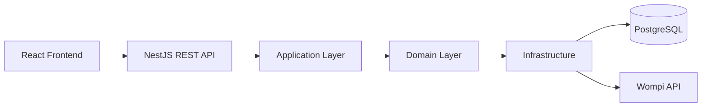
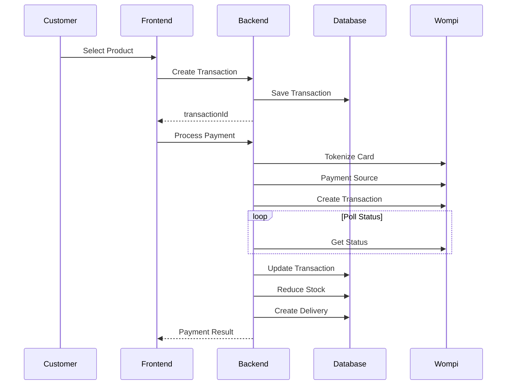

# Ecommerce Inventory Management

> **Full Stack E-commerce Inventory & Payment Platform**


---

# Overview

Ecommerce Inventory Management is a Full Stack application that demonstrates a complete purchasing workflow using a modern architecture.

The project includes:

- Product catalog
- Customer registration
- Transaction creation
- Secure payment through Wompi REST API
- Inventory management
- Delivery generation
- Hexagonal Architecture
- Responsive React Frontend

---

# Technologies

## Frontend

- React
- Vite
- Redux Toolkit
- TailwindCSS
- Axios
- TypeScript

## Backend

- NestJS
- Prisma ORM
- PostgreSQL
- Hexagonal Architecture
- REST API

## External Services

- Wompi REST API

---

# System Architecture



---

# Hexagonal Architecture

The backend follows Hexagonal Architecture.

## Domain

Contains:

- Entities
- Repository Contracts
- Business Rules

No framework dependency.

## Application

Contains:

- Use Cases
- DTOs
- Business Orchestration

## Infrastructure

Contains:

- Prisma
- Controllers
- Repository Implementations
- Wompi Integration

---

# Purchase Flow



---

# Backend Structure

```text
backend/
 src/
  modules/
   customers/
   products/
   transactions/
   payments/
   deliveries/
   shared/
```

---

# Frontend Structure

```text
frontend/
 src/
  components/
  pages/
  services/
  store/
  hooks/
  types/
```

---

# Payment Process

1. Create transaction
2. Retrieve checkout information
3. Tokenize credit card
4. Create payment source
5. Create Wompi transaction
6. Poll transaction status
7. Update transaction
8. Reduce inventory
9. Create delivery
10. Return payment status

---

# Features

- Product Inventory
- Customer Management
- Transaction Management
- REST Payment Integration
- Automatic Delivery Creation
- Stock Validation
- Responsive UI

---

# Installation

## Backend

```bash
cd backend
npm install
npm run prisma:generate
npm run start:dev
```

## Frontend

```bash
cd frontend
npm install
npm run dev
```

---

# Environment Variables

Backend example

```env
DATABASE_URL=
WOMPI_PUBLIC_KEY=
WOMPI_PRIVATE_KEY=
WOMPI_EVENTS_KEY=
PORT=3000
```

Frontend example

```env
VITE_API_URL=http://localhost:3000
```

---

# API Endpoints

| Method | Endpoint | Description |
|---------|----------|-------------|
|GET|/products|List products|
|POST|/customers|Create customer|
|POST|/transactions|Create transaction|
|POST|/payments|Process payment|

---

# Good Practices

- Clean Architecture
- SOLID Principles
- Repository Pattern
- Dependency Injection
- DTO Validation
- Separation of Concerns
- Reusable Components
- Type Safety

---

# Future Improvements

- Authentication
- Order History
- Admin Dashboard
- Unit Testing
- Docker
- CI/CD
- Kubernetes
- Redis Cache

---

# Screenshots

Create an `images/` folder and include:

```text
images/
 home.png
 checkout.png
 payment-success.png
 architecture.png
 payment-flow.png
```

Then reference them:

```md


```

---

# Author

**Andrés Sarmiento**

Software Engineer

---

# License

MIT License
